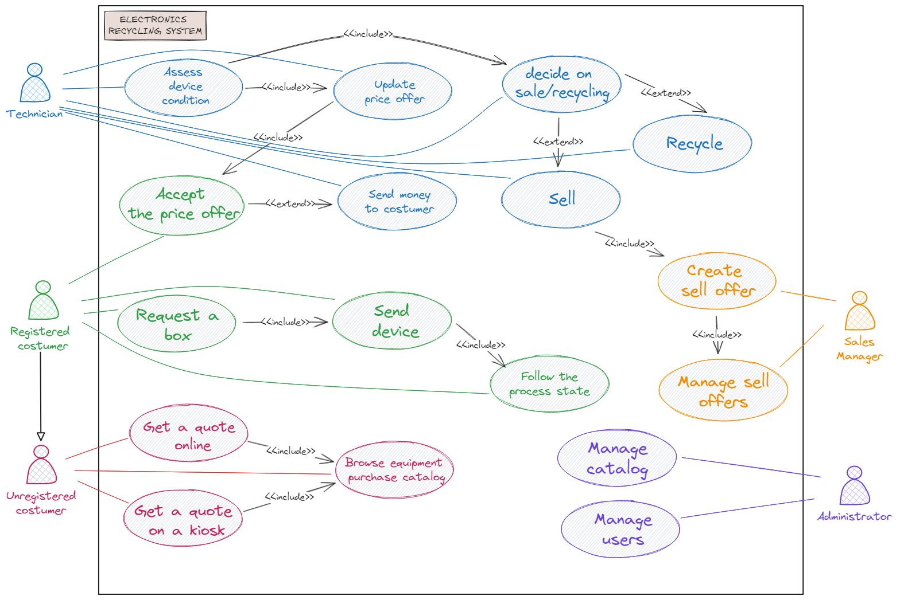

# Electronics Recycling System

## TODO
- [x] Assignment, application description, requirements, additional context
- [x] UseCase diagram
- [x] User roles
- [x] UseCase diagram to english

### Event-oriented Architecture
- [ ] Architecture design
- [ ] Architecture documentation (Component diagram, Deployment diagram)
- [x] ADR (at least 3)
- [x] Advantages and disadvantages

### Service-oriented Architecture (SOA)  
- [ ] Architecture design
- [ ] Architecture documentation (Component diagram, Deployment diagram)
- [ ] ADR (at least 3)
- [x] Advantages and disadvantages

### Evaluation
- [ ] Architecture comparison
- [ ] Selection of more suitable architecture
- [ ] Justification of selection

# Course Assignment
This repository contains the solution for the course assignment from `4IT575 Software Architectures`.

## Team Members
- [Najman Matouš](https://github.com/najmamat) [najmamat]
- [Veis Michael](https://github.com/michaelveis) []
- [Fiedler Josef](https://github.com/fiedler256) [fiedler256]
- [Beran Štěpán](https://github.com/sberan1) [sberan1]

## Assignment
A large electronics retailer wants to start a business in electronics recycling and needs a new system. Customers can send their small personal electronic devices or use local kiosks in shopping centers and potentially receive money for their used device if it is in working condition.

### Users
Hundreds, potentially thousands to millions...

### Requirements
- Customers can receive offers for used personal electronic equipment (phones, cameras, etc.) either through the website or a kiosk in a shopping center.
- Customers receive a box by mail, send their electronic device, and if it's in good condition, they get paid.
- Upon receiving the device, it is assessed/checked whether it can be recycled/safely disposed of or sold (eBay, etc.).
- The company expects to add 5-10 new types of electronics each month that they will accept.

### Additional Context
- This is a highly competitive activity and a new business area for us.
- If we haven't received a certain type of electronic device even once in the past year, we remove it from our system.
- We need to maintain a list of electronic devices we are willing to accept, as it changes frequently.
- Each device has its own assessment/checking rules.
- We have the right to change the original price offer to the customer if the product is not in the condition declared by the customer.

### User Roles and Use Cases

*Informal UC diagram primarily serving for understanding the assignment*

#### Unregistered Customer
- Can browse the catalog of accepted devices
- Can get a preliminary price offer for their device
- Can register
- Can use a kiosk in a shopping center to get an offer

#### Registered Customer
- Can manage their personal information
- Can request shipping box delivery
- Can track their shipment status through integration with Zásilkovna and PPL
- Can accept or reject adjusted price offers
- Can manage their payment details
- Can rate the service and recycling process
- Can communicate with customer support

#### System Administrator
- Can manage the catalog of accepted devices
- Can add/modify device assessment rules
- Can manage user accounts and roles
- Can generate reports and statistics
- Can set pricing policies
- Can manage integrations with carriers

#### Device Inspector
- Can assess received devices according to established rules
- Can adjust price offers based on actual device condition
- Can mark devices as suitable for recycling/sale
- Can initiate customer payment process
- Can document received device condition (photos, notes)

#### Sales Manager
- Can manage listings on sales platforms (eBay, Aukro)
- Can set device selling prices
- Can track sales success across platforms
- Can manage communication with buyers on sales platforms
- Can generate sales reports

#### Customer Support
- Can respond to customer inquiries
- Can handle complaints and claims
- Can modify basic customer information
- Can track shipment status and inform customers

