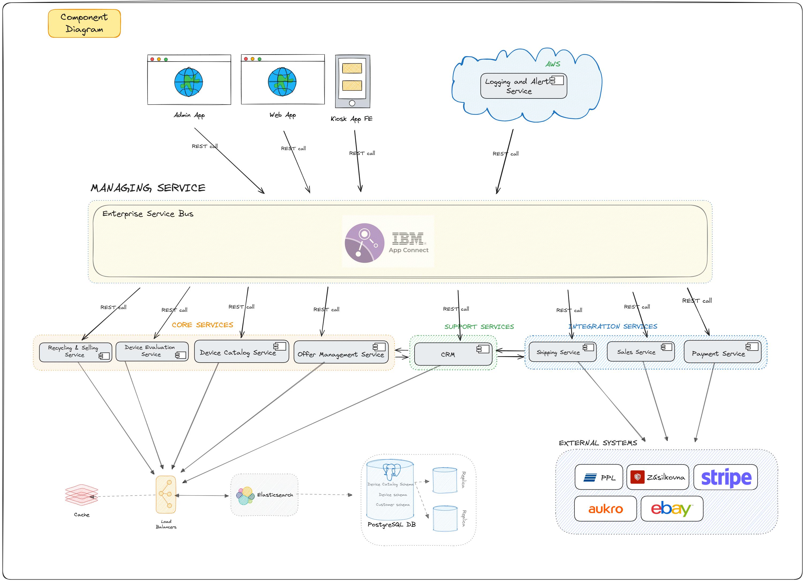
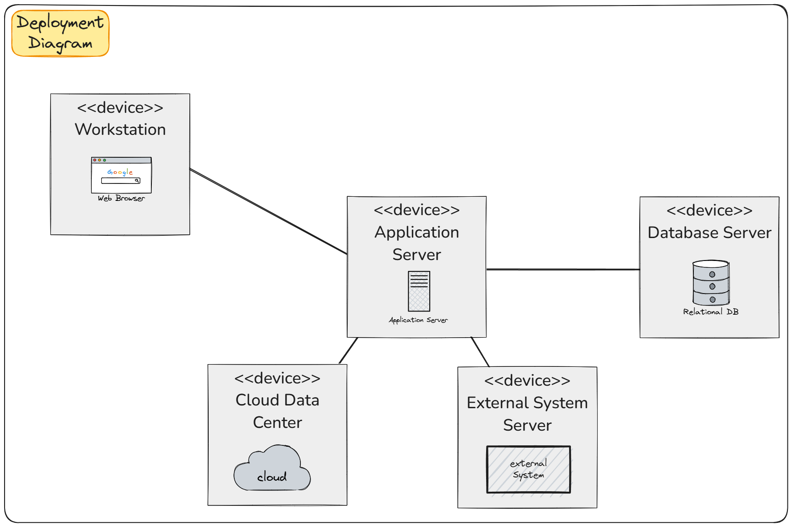

# Service Oriented Architecture - Advantages and Disadvantages

## Advantages

### 1. Architecture-Driven Code Organisation
- Code is logically separated into independent services, enhancing modularity.
- Improves transparency by clearly defining boundaries and responsibilities of services.
- Enhances ease of maintenance by isolating issues within specific services.
- Naturally suited for domain-driven design, which is highly relevant for handling the business logic in our project.

### 2. Reusability
- Services can be reused across multiple applications or modules.
- Encourages consistency and reduces redundancy in development.

### 3. Scalability
- Facilitates load distribution and optimized resource allocation.
- Individual services can scale independently to handle thousands or millions of users as required.

### 4. Flexibility
- Services can use different technologies and programming languages.
- Allows teams to choose the best tools for each specific service.

### 5. Interoperability
- Promotes integration between disparate systems via standardized protocols (e.g., REST, SOAP).
- Simplifies communication with third-party systems and legacy applications.

## Disadvantages

### 1. Increased Complexity
- Managing multiple services introduces complexity in deployment, orchestration, and monitoring.
- Requires robust DevOps practices to handle the complexity.

### 2. Performance Limitations
- Services relying on network calls may experience performance overhead, such as latency, particularly when communicating with external APIs like carriers or sales platforms.

### 3. Testing Challenges
- Testing an entire system can be difficult due to dependencies and inter-service communication.
- Requires specialized tools for end-to-end testing.

### 4. Security Risks
- Increased exposure of services through network endpoints creates more attack surfaces.
- Requires rigorous security protocols, such as authentication and encryption.

## Mitigation Strategies

### 1. Simplify Service Management
- Use container orchestration tools like Kubernetes to handle service deployment and scaling.
- Implement service meshes for traffic management and observability to reduce complexity.

### 2. Improve Performance
- Optimize communication protocols by using lightweight options such as gRPC.
- Introduce caching layers to reduce repetitive service calls and improve response times.

### 3. Enhance Testing Processes
- Use contract testing to ensure inter-service communication works as expected.
- Automate end-to-end testing with tools designed for distributed systems, such as Postman or Selenium.

### 4. Strengthen Security
- Secure all endpoints with HTTPS and implement robust authentication methods like OAuth.
- Deploy API gateways to centralize security policies and manage traffic effectively.

# Service Oriented Architecture - Diagrams

